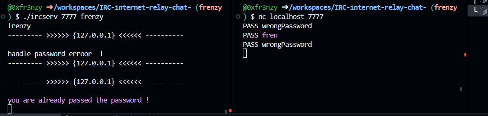

Infinit loop in the server:

If you hit ctrl+c in the nc sessoin the server enters an endless loop

---

You can login with a partial valid password (if the password is frenzy you can login with fre):

---
segv:

 ./ircserv localhost 6667
terminate called after throwing an instance of 'std::invalid_argument'
  what():  Invalid integer string: localhost
Aborted (core dumped)

---

./ircserv 127.0.0.1 6667

leaks

--